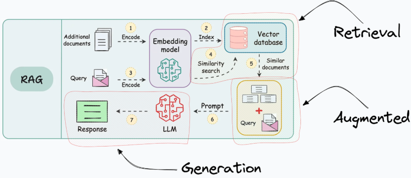

<div align="center">
  
  <h1>NeuraParse</h1>
</div>

# NeuraParse: Intelligent Document Q&A and Repository Visualizer

NeuraParse is a multi-functional application designed to help you understand complex information from various sources. It offers two primary features:

1.  **Document Q&A:** Upload your documents (PDFs, DOCX, images, CSV, Excel) and ask questions about their content. The system extracts information, including text, images, and tables, uses advanced AI models (Gemini) to understand them, and provides contextually relevant answers based *only* on the uploaded documents.
2.  **GitHub Repository Visualizer:** Enter a GitHub repository URL to get an AI-generated explanation of the codebase structure, key components, and their relationships, presented as a visual mind map (using Mermaid syntax) and a file structure overview.

## Features

*   **Multi-Format Document Support:** Handles PDF, DOCX, TXT, Image files (JPG, PNG etc.), CSV, and Excel (XLSX/XLS).
*   **Intelligent Content Extraction:**
    *   Extracts text directly from PDF and DOCX files.
    *   **Uses Gemini Vision:** Analyzes images within PDFs or standalone image files to generate rich descriptions.
    *   **Uses Gemini & PDFPlumber:** Extracts tables from PDFs, summarizes them using Gemini.
    *   **Uses Pandas:** Profiles CSV/Excel files (column names, types, null counts, sample data) and creates a textual summary for analysis.
*   **Contextual Q&A:** Answers questions based *strictly* on the content extracted and summarized from your uploaded documents.
*   **Source Highlighting:** Indicates which part of which document (including page numbers, image descriptions, or table summaries) was used to generate the answer.
*   **GitHub Repository Analysis:**
    *   Fetches repository structure and file contents (excluding binary files).
    *   Uses AI (Gemini) to analyze code relationships and generate explanations.
    *   Displays a clear file structure tree.
    *   Generates a Mermaid flowchart visualizing the architecture.
*   **Web Interface:** Simple and intuitive UI built with HTML, CSS, and JavaScript.
*   **FastAPI Backend:** Robust and efficient backend server.
*   **FAISS Vector Store:** Efficiently stores and retrieves document embeddings for fast Q&A.

## How it Works (Document Q&A)

1.  **Upload:** User uploads one or more files via the web interface.
2.  **Routing & Extraction:**
    *   The backend identifies the file type (PDF, DOCX, TXT, image, CSV, Excel).
    *   **PDF:** Extracts text using `PyMuPDF`. Extracts images and tables using `PyMuPDF` and `pdfplumber`.
    *   **DOCX:** Extracts text using `python-docx`.
    *   **Images:** No direct text extraction; the image itself is processed later.
    *   **CSV/Excel:** Uses `pandas` to read the data and generate a profile (column names, types, nulls, shape, sample rows). This profile becomes the "extracted text".
    *   **(Optional) Link Crawling:** For text-based files (PDF, DOCX, TXT), it can find HTTP(S) links and crawl the linked page (1 level deep) to include its content.
3.  **Multimodal Processing (Images/Tables):**
    *   Extracted images (from PDFs or standalone) and tables (from PDFs) are sent to the Gemini Vision API (`gemini-2.0-flash`).
    *   Gemini generates a textual description/summary for each image or table.
4.  **Embedding & Indexing:**
    *   Extracted text (from PDF, DOCX, TXT), CSV/Excel profiles, and the Gemini-generated summaries of images/tables are chunked.
    *   Each chunk is converted into a vector embedding using a Google Generative AI embedding model.
    *   Chunks and their embeddings are stored in a FAISS vector database, along with metadata (original filename, page number, type - text/image/table/profile).
5.  **Query:** User asks a question.
6.  **Retrieval:** The question is embedded, and the vector store finds the most semantically similar chunks (text, image summaries, table summaries, CSV/Excel profiles).
7.  **Answer Generation:**
    *   The retrieved chunks and the original question are passed to a Gemini model (`gemini-2.0-flash`).
    *   A specific prompt instructs the model to answer based *only* on the provided context chunks. A different prompt is used if the context comes from a CSV/Excel profile, guiding the model on how to interpret the profile data.
    *   The generated answer and the source metadata of the relevant chunks are returned.
8.  **Display:** The answer and formatted sources are shown to the user.

## How it Works (GitHub Visualizer)

1.  **Input:** User provides a GitHub repository URL.
2.  **API Fetching:** The backend uses the GitHub API to recursively fetch the repository's file structure and the content of non-binary files.
3.  **Structure Generation:** A simple text-based tree view of the repository structure is created.
4.  **AI Analysis:** The file contents and structure are passed to a Gemini model (`gemini-2.0-flash`) with a prompt asking it to analyze the relationships, identify key components, and generate an overall explanation. It's also asked to represent the relationships in Mermaid flowchart syntax.
5.  **Display:** The AI-generated explanation, the file structure tree, and the rendered Mermaid mind map are displayed to the user.

## Tech Stack

*   **Backend:** Python, FastAPI, Uvicorn
*   **Frontend:** HTML, CSS, JavaScript
*   **AI Models:** Google Generative AI (Gemini Pro/Flash for generation, embeddings, vision)
*   **Data Handling:** Pandas (CSV/Excel), PyMuPDF (PDF text/images), python-docx (DOCX), pdfplumber (PDF tables)
*   **Vector Store:** FAISS (CPU version)
*   **API Interaction:** Requests (GitHub API)
*   **Environment:** Python 3.10+

## Setup and Installation

1.  **Clone the repository:**
    ```bash
    git clone <your-repo-url>
    cd <repo-directory>
    ```
2.  **Create a virtual environment:**
    ```bash
    python -m venv venv
    source venv/bin/activate  # On Windows use `venv\Scripts\activate`
    ```
3.  **Install dependencies:**
    ```bash
    pip install -r requirements.txt
    ```
4.  **Environment Variables:**
    Create a `.env` file in the project root directory and add your API keys:
    ```dotenv
    GEMINI_API_KEY=YOUR_GOOGLE_GENERATIVE_AI_API_KEY
    GITHUB_ACCESS_TOKEN=YOUR_GITHUB_PERSONAL_ACCESS_TOKEN # Optional, for higher rate limits
    ```
    *   Get your Gemini API key from [Google AI Studio](https://aistudio.google.com/app/apikey).
    *   A GitHub token (with `repo` scope) is recommended for the visualizer to avoid rate limiting.
5.  **Run the application:**
    ```bash
    uvicorn backend.app:app --reload --host 0.0.0.0 --port 8000
    ```
    *   `--reload` enables auto-reloading on code changes (useful for development).
6.  **Access the application:**
    Open your web browser and navigate to `http://localhost:8000`.

## Usage

*   **Document Q&A:**
    *   Click "Choose files..." under the "Document Q&A" section.
    *   Select one or more supported files (PDF, DOCX, TXT, PNG, JPG, CSV, XLSX).
    *   Wait for the upload and processing confirmation.
    *   Type your question in the "Ask a question..." box and click "Ask".
    *   The answer and sources will appear below.
*   **GitHub Visualizer:**
    *   Enter a valid GitHub repository URL (e.g., `https://github.com/owner/repo`) in the "GitHub Repository URL" field.
    *   Click "Analyze Repository".
    *   Wait for the analysis to complete.
    *   The explanation, file structure, and mind map will be displayed.

## Limitations & Future Work

*   **Excel (.xls):** Requires the `xlrd` library (optional dependency).
*   **Password-Protected Files:** Cannot process encrypted or password-protected PDFs/DOCX.
*   **Complex Formatting:** Might struggle with highly complex layouts or non-standard document structures.
*   **Link Crawling Depth:** Currently limited to one level deep.
*   **Visualizer Scalability:** Analysis of very large repositories might be slow or hit API limits.
*   **Error Handling:** More robust error handling can be added for edge cases during file processing and API calls.
*   **Visual Element Display:** Currently shows summaries/descriptions of images/tables as sources. Could potentially display the actual visuals.
*   **Streaming Answers:** Implement streaming for Q&A responses for better UX.
*   **Configuration:** Make model names, chunk sizes, etc., configurable via `.env`.

## Contributing

Contributions are welcome! Please feel free to submit pull requests or open issues.

---

## 🔮 Future Improvements (TODO)

- [ ] **Prompt Engineering:** Explore advanced prompting techniques (e.g., few-shot, HyDE).
- [ ] **Asynchronous Processing:** Implement background tasks for uploads and analysis.
- [ ] **Error Handling & UI Feedback:** Improve reporting for processing errors.
- [ ] **Search/Retrieval:** Hybrid search, metadata filtering.
- [ ] **Deployment:** Containerize (Docker).
- [ ] **Multi-User:** Authentication/sessions.
- [ ] **Context Management:** Token limits.
- [ ] **UI Polish:** Loading indicators, source distinction.

---

## 📊 What is happening

<div align="center">
  
</div> 