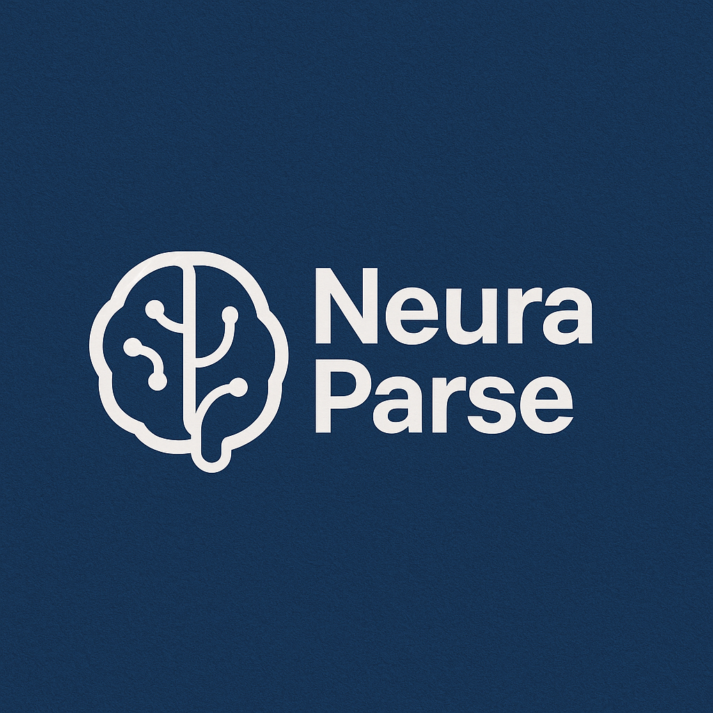

<div align="center">
  
</div>

# NeuraParse - AI Document Q&A System

This project implements a system for answering questions based on a collection of uploaded documents using Retrieval-Augmented Generation (RAG) with Google's Gemini AI.

---

## ✨ Features

*   **Multiple Document Upload:** Upload one or more documents simultaneously through the web interface.
*   **Wide File Type Support:** Processes various formats:
    *   📄 Documents: `.pdf`, `.docx`, `.pptx`, `.xlsx`
    *   📊 Data: `.csv`, `.json`
    *   📝 Text: `.txt`, `.md`, `.html`
    *   🖼️ Images: `.jpg`, `.jpeg`, `.png`, `.tiff`, `.bmp` (using OCR)
*   **Text Extraction & OCR:** Extracts text directly from documents and performs OCR on images and scanned PDFs.
*   **Vector Indexing:** Generates embeddings for text chunks and stores them in a FAISS vector database for efficient semantic search.
*   **AI-Powered Q&A:** Uses Google Gemini to generate answers based *only* on the relevant context retrieved from your documents.
*   **Source Citation:** Displays the document snippets used to generate the answer, along with relevance scores.
*   **Web Interface:** Simple and restyled frontend for uploading files, asking questions, and viewing results.

---

## 🛠️ Tech Stack

*   **Backend:** Python, FastAPI, Uvicorn
*   **AI:** Google Generative AI (Gemini - `gemini-2.0-flash` by default)
*   **Vector Store:** FAISS (`faiss-cpu`)
*   **File Processing:** PyMuPDF, python-docx, python-pptx, openpyxl, pandas, pytesseract (for OCR)
*   **Frontend:** HTML, CSS, JavaScript
*   **Environment:** python-dotenv

---

## 🚀 Getting Started

### Prerequisites

*   Python 3.9+
*   Pip (Python package installer)
*   Git
*   Tesseract OCR (See Step 4 below for installation link)
*   A Google Gemini API Key

### Setup Instructions

1.  **Clone the repository:**
    ```bash
    git clone <repository-url> # Replace with your repo URL
    cd ai-doc-qa-system
    ```

2.  **Create and activate a Python virtual environment:**
    ```bash
    # Linux/macOS
    python -m venv venv
    source venv/bin/activate

    # Windows (Command Prompt/PowerShell)
    python -m venv venv
    .\venv\Scripts\activate
    ```

3.  **Install Python dependencies:**
    ```bash
    pip install -r requirements.txt
    ```
    *Note:* This installs `faiss-cpu`. For GPU support, consult FAISS documentation for installing `faiss-gpu`.

4.  **Install Tesseract OCR (Required for Image Processing):**
    - Follow the official Tesseract installation guide for your OS: [Tesseract Installation Docs](https://tesseract-ocr.github.io/tessdoc/Installation.html)
    - **Crucially, ensure the `tesseract` command is added to your system's PATH environment variable during or after installation.**

5.  **Configure Environment Variables:**
    - Create a `.env` file in the project root (`ai-doc-qa-system/`).
    - Add the following, replacing the placeholder with your actual key:
      ```dotenv
      # --- Required --- 
      GEMINI_API_KEY="YOUR_ACTUAL_GEMINI_API_KEY"

      # --- Optional --- 
      # Override default data paths (relative to backend/app.py location)
      # UPLOAD_DIR="data/uploads"
      # PROCESSED_DIR="data/processed"
      # VECTOR_STORE_PATH="data/processed/vector_store"
      
      # Set log level (DEBUG, INFO, WARNING, ERROR, CRITICAL)
      # LOG_LEVEL="INFO"

      # Specify Tesseract command path if not in system PATH
      # TESSERACT_CMD="/path/to/your/tesseract"
      ```

### Running the Application

1.  **Start the Backend Server:**
    - Ensure your virtual environment is activated.
    - From the project root (`ai-doc-qa-system/`), run:
      ```bash
      uvicorn backend.app:app --reload --port 8000
      ```
      *(`--reload` is for development; remove it for stable runs)*

2.  **Access the Frontend:**
    - Open your web browser and go to: `http://localhost:8000/`
    - The backend serves the frontend automatically.
    - You can also access the API documentation (Swagger UI) at `http://localhost:8000/docs`.

---

## 📝 Usage

1.  Navigate to `http://localhost:8000/`.
2.  In the **Upload Documents** section:
    *   Click **Choose files...** and select one or more supported documents.
    *   The names of selected files will appear below the button.
    *   Click **Upload Files**.
3.  Wait for the backend to process the files (check the backend console logs for progress/status).
4.  In the **Ask a Question** section:
    *   Type your question about the uploaded documents.
    *   Click **Get Answer**.
5.  The AI-generated answer and the source document snippets used will appear below.

---

## 🔮 Future Improvements (TODO)

- [ ] **Asynchronous Processing:** Implement background tasks (FastAPI BackgroundTasks or Celery) for file ingestion to prevent blocking the server during long uploads/processing.
- [ ] **Error Handling:** Enhance user feedback for processing errors directly in the UI.
- [ ] **Search Enhancements:** Implement hybrid search (keyword + semantic) and metadata filtering.
- [ ] **Testing:** Add comprehensive unit and integration tests.
- [ ] **Deployment:** Containerize using Docker.
- [ ] **Multi-User:** Add user authentication/sessions.
- [ ] **Prompt Engineering:** Explore advanced prompting techniques (e.g., few-shot, HyDE).
- [ ] **Context Management:** Implement context length checks and smarter truncation.
- [ ] **UI Polish:** Improve visual distinction between sources, add loading indicators for Q&A. 